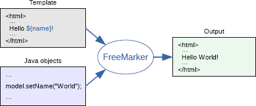

## freemarker  
* 这个图片很经典了啊  
  
* 如果需要用到的话，要进行深入的了解[freemarker](http://freemarker.foofun.cn/index.html)
* FreeMarker是一款模板引擎： 即一种基于模板和要改变的数据，	并用来生成输出文本（HTML网页、电子邮件、配置文件、源代码等）的通用工具。	它不是面向最终用户的，而是一个Java类库，是一款程序员可以嵌入他们所开发产品的组件。
* FreeMarker 是一款 模板引擎： 即一种基于模板和要改变的数据， 并用来生成输出文本(HTML网页，电子邮件，配置文件，源代码等)的通用工具。 它不是面向最终用户的，而是一个Java类库，是一款程序员可以嵌入他们所开发产品的组件。


````
Tue Sep 18 10:30:35 CST 2018 WARN: Establishing SSL connection without server's identity verification is not recommended. According to MySQL 5.5.45+, 5.6.26+ and 5.7.6+ requirements SSL connection must be established by default if explicit option isn't set. For compliance with existing applications not using SSL the verifyServerCertificate property is set to 'false'. You need either to explicitly disable SSL by setting useSSL=false, or set useSSL=true and provide truststore for server certificate verification.
````
* 解决办法如下 https://blog.csdn.net/cocoaxian/article/details/72235495 
```
## 数据源配置  数据库连接有问题
spring.datasource.url= jdbc:mysql://localhost:3306/shiming?useUnicode=true&characterEncoding=utf-8&useSSL=true
spring.datasource.username=root
spring.datasource.password=App123
spring.datasource.driver-class-name=com.mysql.jdbc.Driver 

```


* 关于依赖的问题  
```
        <!-- Spring Boot Freemarker 依赖  如果去掉的话 请求会报错 This application has no explicit mapping for /error, so you are seeing this as a fallback. -->
        <dependency>
            <groupId>org.springframework.boot</groupId>
            <artifactId>spring-boot-starter-freemarker</artifactId>
        </dependency> 
```


* org.spring.springboot.controller - Controller 层
* org.spring.springboot.dao - 数据操作层 DAO
* org.spring.springboot.domain - 实体类
* org.spring.springboot.service - 业务逻辑层
* Application - 应用启动类
* resources/application.properties - 应用配置文件，应用启动会自动读取配置
* resources/web - *.ftl文件，是 FreeMarker 文件配置路径。在 application.properties 配置
* resources/mapper - DAO Maper XML 文件